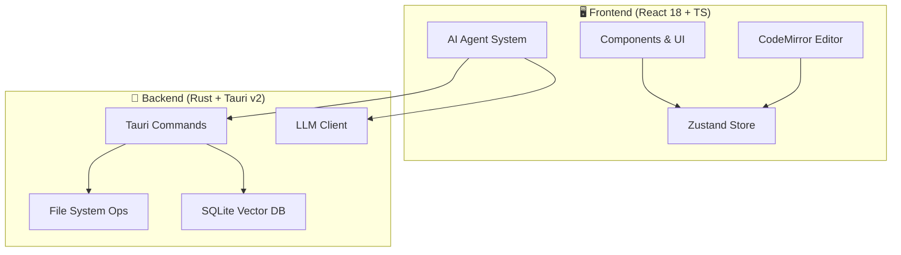

<div align="center">


# ✨ Lumina Note

**本地优先 · AI 驱动 · 现代知识库**

构建属于你的第二大脑，支持 Agent 自动化的 Markdown 笔记应用。

[](https://tauri.app/)
[](https://react.dev/)
[](https://www.rust-lang.org/)
[](LICENSE)

[快速开始](#-快速开始) • [功能特性](#-核心特性) • [技术架构](#-技术架构) • [贡献指南](#)

<br/>


</div>

<br/>

---

## 🎯 核心特性

Lumina Note 不仅仅是一个编辑器，它是一个集成了 LLM 能力的知识生产环境。

### 📝 沉浸式编辑体验
* **多模式切换**：无缝切换 **源码 / 实时预览 / 阅读模式**。
* **双向链接**：使用 `[[WikiLinks]]` 构建网状知识图谱。
* **专业排版**：原生支持 LaTeX 数学公式、Mermaid 图表及 Obsidian 风格 `> [!info]` 提示块。
* **语法高亮**：基于 CodeMirror 6，支持上百种语言的代码高亮。

### 🕸️ 知识图谱
基于 Canvas 的高性能可视化引擎，直观展示笔记间的关联关系。

| 功能 | 描述 |
| :--- | :--- |
| **文件夹层级** | 文件夹作为节点显示（带刺圆球样式），父子关系带箭头连线 |
| **颜色分区** | 按文件夹自动分配颜色，子节点继承父文件夹颜色 |
| **双向链接** | `[[WikiLinks]]` 自动解析为节点间的连线 |
| **右键孤立查看** | 右键点击任意节点，可在新标签页中查看该节点及其直接关联的节点 |
| **物理引擎** | 可调节的斥力、弹力、向心力参数，支持拖拽节点和画布缩放 |

### 🤖 AI Agent 系统
| 模块 | 功能描述 |
| :--- | :--- |
| **Agent 模式** | 能够理解意图，自动执行读取、编辑、搜索笔记等复杂任务链。 |
| **AI 悬浮球** | 随时唤起的助手，支持拖拽，不打断当前心流。 |
| **语音输入** | 基于 Web Speech API 的语音转文字，支持流式显示、自动停止、录音动画。 |
| **Diff 预览** | AI 修改内容前提供 Diff 对比视图，由你决定是否 Apply。 |
| **RAG 语义搜索** | 内置 SQLite 向量库，基于语义理解检索你的本地知识库。 |

### 🎬 B站视频笔记
边看视频边做笔记，通过弹幕同步实现精确时间戳记录。

| 功能 | 描述 |
| :--- | :--- |
| **内嵌播放** | 在应用内直接播放 B站视频，支持登录和发弹幕 |
| **弹幕同步** | 发送带前缀的弹幕（如 `#笔记内容`），一键同步为带时间戳的笔记 |
| **时间跳转** | 点击笔记时间戳，视频自动跳转到对应位置（无需刷新） |
| **自动保存** | 笔记自动保存为 Markdown 文件，下次打开同一视频自动加载 |

> 💡 技术亮点：使用 Tauri 2.0 多 WebView 功能实现真正的内嵌播放，突破 iframe 的 CSRF 限制

### 🔌 多模型生态
支持接入主流 LLM Provider，自由切换模型：
> `Anthropic` · `OpenAI` · `DeepSeek` · `Moonshot` · `Groq` · `Ollama (Local)`

---

## 🛠️ 技术架构

本项目采用 **Rust + React** 的前后端分离架构，通过 Tauri v2 进行原生能力桥接。



### 技术栈清单

* **Core**: [Tauri v2](https://v2.tauri.app/)
* **UI**: React 18, Tailwind CSS, Radix UI
* **Editor**: CodeMirror 6
* **State**: Zustand
* **Database**: SQLite (Vector Extension)
* **Lang**: TypeScript, Rust

---

## 🚀 快速开始

### 环境准备
在此之前，请确保你的环境已安装：
* **Node.js**: 18.0+
* **Rust**: 1.70+
* **包管理器**: npm 或 pnpm

### 安装步骤

1.  **克隆仓库**
    ```bash
    git clone [https://github.com/blueberrycongee/Lumina-Note.git](https://github.com/blueberrycongee/Lumina-Note.git)
    cd Lumina-Note
    ```

2.  **安装依赖**
    ```bash
    npm install
    # 或者 pnpm install
    ```

3.  **开发模式运行**
    ```bash
    npm run tauri dev
    ```

4.  **构建生产包**
    ```bash
    npm run tauri build
    ```

---

## ⌨️ 快捷键指南

| 组合键 | 作用 |
| :--- | :--- |
| `Ctrl/Cmd + P` | **命令面板** (类似于 VSCode) |
| `Ctrl/Cmd + S` | 保存当前文件 |
| `Ctrl/Cmd + N` | 新建笔记 |
| `Ctrl/Cmd + Shift + F` | 全局语义/关键字搜索 |
| `Ctrl/Cmd + B` | 切换侧边栏显隐 |

---

## 🗺️ Roadmap

- [x] **Core**: 多 LLM Provider 接入支持
- [x] **Agent**: 具备工具调用能力的 AI Agent 系统
- [x] **RAG**: 本地向量数据库与语义检索
- [x] **UI**: AI 悬浮球与流式响应交互
- [x] **Video**: B站视频笔记（内嵌 WebView + 弹幕同步）
- [x] **STT**: 语音转文字（流式显示 + 自动停止 + 录音动画）
- [ ] **Feature**: 历史会话持久化存储
- [ ] **Feature**: 插件系统 API 设计
- [ ] **Sync**: WebDAV / Git 同步支持

---

## 📁 项目结构概览

```
lumina-note/
├── src/
│   ├── agent/           # AI Agent 核心逻辑 (Core, Tools, Prompts)
│   ├── components/      # React UI 组件
│   ├── editor/          # CodeMirror 编辑器配置与扩展
│   ├── services/        # LLM 客户端与 RAG 服务层
│   └── stores/          # Zustand 状态管理
├── src-tauri/
│   └── src/
│       ├── commands/    # 暴露给前端的 Rust 命令
│       ├── fs/          # 文件系统操作封装
│       └── vector_db/   # SQLite 向量存储逻辑
└── package.json
```

---

## 🤝 致谢与协议

**Credits**
* Agent 架构与流式处理部分参考了 [Roo-Code](https://github.com/RooVetGit/Roo-Code) 的优秀实现。

**License**
* 本项目基于 [Apache License 2.0](LICENSE) 开源。
