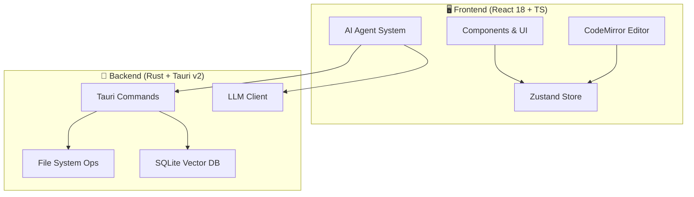

<div align="center">


# ✨ Lumina Note

**本地优先 · AI 驱动 · 现代知识库**

构建属于你的第二大脑，支持 Agent 自动化的 Markdown 笔记应用。

[](https://tauri.app/)
[](https://react.dev/)
[](https://www.rust-lang.org/)
[](LICENSE)

**Language**：简体中文 · [English README](./README.en.md)

[快速开始](#-快速开始) • [功能特性](#-核心特性) • [使用指南](#-使用指南) • [技术架构](#-技术架构)

</div>

<br/>

---

## 🎯 核心特性

Lumina Note 不仅仅是一个编辑器，它是一个集成了 LLM 能力的知识生产环境。

### 📝 沉浸式编辑体验

- **多模式切换**：无缝切换 **源码 / 实时预览 / 阅读模式**
- **双向链接**：使用 `[[WikiLinks]]` 构建网状知识图谱
- **专业排版**：原生支持 LaTeX 数学公式、Mermaid 图表及 Obsidian 风格 `> [!info]` 提示块
- **语法高亮**：基于 CodeMirror 6，支持上百种语言的代码高亮
- **分栏编辑**：水平/垂直分栏，可拖拽调整大小，活动面板自动接收新文件

### 🕸️ 知识图谱

基于 Canvas 的高性能可视化引擎，直观展示笔记间的关联关系。

| 功能             | 描述                                                         |
| :--------------- | :----------------------------------------------------------- |
| **文件夹层级**   | 文件夹作为节点显示（带刺圆球样式），父子关系带箭头连线       |
| **颜色分区**     | 按文件夹自动分配颜色，子节点继承父文件夹颜色                 |
| **双向链接**     | `[[WikiLinks]]` 自动解析为节点间的连线                       |
| **右键孤立查看** | 右键点击任意节点，可在新标签页中查看该节点及其直接关联的节点 |
| **物理引擎**     | 可调节的斥力、弹力、向心力参数，支持拖拽节点和画布缩放       |

### 🤖 AI Agent 系统

| 模块             | 功能描述                                                             |
| :--------------- | :------------------------------------------------------------------- |
| **Agent 模式**   | 能够理解意图，自动执行读取、编辑、搜索笔记等复杂任务链。             |
| **AI 悬浮球**    | 随时唤起的助手，支持拖拽，不打断当前心流。                           |
| **语音输入**     | 基于 Web Speech API 的语音转文字，支持流式显示、自动停止、录音动画。 |
| **Diff 预览**    | AI 修改内容前提供 Diff 对比视图，由你决定是否 Apply。                |
| **RAG 语义搜索** | 内置 SQLite 向量库，基于语义理解检索你的本地知识库。                 |

### 🎬 B 站视频笔记

边看视频边做笔记，通过弹幕同步实现精确时间戳记录。

| 功能         | 描述                                                         |
| :----------- | :----------------------------------------------------------- |
| **内嵌播放** | 在应用内直接播放 B 站视频，支持登录和发弹幕                  |
| **弹幕同步** | 发送带前缀的弹幕（如 `#笔记内容`），一键同步为带时间戳的笔记 |
| **时间跳转** | 点击笔记时间戳，视频自动跳转到对应位置（无需刷新）           |
| **自动保存** | 笔记自动保存为 Markdown 文件，下次打开同一视频自动加载       |

> 💡 技术亮点：使用 Tauri 2.0 多 WebView 功能实现真正的内嵌播放，突破 iframe 的 CSRF 限制

### 📄 PDF 智能阅读器

为学术工作流优化的 PDF 阅读和标注系统。

| 功能               | 描述                                                     |
| :----------------- | :------------------------------------------------------- |
| **交互式元素识别** | 自动识别文本、图片、表格等元素，支持悬浮高亮和点击选中   |
| **PDF 批注系统**   | 选中文本添加高亮/下划线，支持 5 种颜色和笔记             |
| **批注笔记同步**   | 批注自动保存为 Markdown 文件，与 PDF 同目录              |
| **双向跳转**       | 点击笔记中的链接跳转到 PDF 对应位置，Ctrl+Click 分栏打开 |
| **缩略图与目录**   | 侧边栏显示页面缩略图和文档大纲，快速跳转                 |
| **全文搜索**       | 支持在 PDF 中搜索关键词，实时高亮匹配结果                |
| **与 AI 对话**     | 将选中的 PDF 内容发送给 AI，进行摘要、翻译或解释         |

> 💡 技术亮点：批注存储为纯 Markdown 文件，支持 `lumina://pdf` 协议链接跳转，完全离线可用

### 🎨 主题系统

| 功能              | 描述                                                       |
| :---------------- | :--------------------------------------------------------- |
| **15 套官方主题** | 默认/海洋/森林/薰衣草/玫瑰/落日/薄荷/靛青/拿铁/极光/极简等 |
| **明暗双模式**    | 每套主题都有明亮和暗黑两种模式（共 30 种外观）             |
| **Markdown 颜色** | 主题影响标题/链接/代码块/引用等 17 种元素                  |
| **设置面板**      | 左下角齿轮图标，统一管理主题、AI、RAG 等设置               |

### 🔌 多模型生态

支持接入主流 LLM Provider，自由切换模型：

> `Anthropic` · `OpenAI` · `Gemini` · `DeepSeek` · `Moonshot` · `Groq` · `Ollama (Local)`

---

## 🛠️ 技术架构

本项目采用 **Rust + React** 的前后端分离架构，通过 Tauri v2 进行原生能力桥接。



### 技术栈清单

- **Core**: [Tauri v2](https://v2.tauri.app/)
- **UI**: React 18, Tailwind CSS, Radix UI
- **Editor**: CodeMirror 6
- **State**: Zustand
- **Database**: SQLite (Vector Extension)
- **Lang**: TypeScript, Rust

---

## 🚀 快速开始

### 环境准备

在此之前，请确保你的环境已安装：

- **Node.js**: 18.0+
- **Rust**: 1.70+
- **包管理器**: npm 或 pnpm

### 安装步骤

1.  **克隆仓库**

    ```bash
    git clone [https://github.com/blueberrycongee/Lumina-Note.git](https://github.com/blueberrycongee/Lumina-Note.git)
    cd Lumina-Note
    ```

2.  **安装依赖**

    ```bash
    npm install
    # 或者 pnpm install
    ```

3.  **开发模式运行**

    ```bash
    npm run tauri dev
    ```

4.  **构建生产包**
    ```bash
    npm run tauri build
    ```

### PDF 元素识别功能（可选）

如果需要使用 PDF 智能识别功能（交互式元素选择），需要启动后端解析服务：

1.  **安装 Python 依赖**（首次使用）

    ```bash
    cd scripts
    pip install flask flask-cors pymupdf
    ```

2.  **启动 PDF 解析服务**

    ```bash
    python simple_pdf_server.py
    ```

    服务将在 `http://localhost:8080` 启动。

3.  **在应用中使用**
    - 打开任意 PDF 文件
    - 点击右上角 **"交互模式"** 按钮（闪电图标）
    - 鼠标悬浮在文本/图片上即可看到高亮
    - 点击元素选中，Ctrl+点击多选
    - 右侧元素面板可复制引用或与 AI 对话

> **进阶选项**：如需更精确的版面分析（表格、公式识别），可使用 PP-Structure：
>
> ```bash
> cd scripts
> pip install -r requirements-pp-structure.txt
> python pp_structure_server.py
> ```
>
> 详见 [`docs/PP_STRUCTURE_SETUP.md`](docs/PP_STRUCTURE_SETUP.md)

---

## 📖 使用指南

### 首次使用

1. **选择工作区（Vault）**：

   - 首次启动时选择一个文件夹作为笔记库
   - ⚠️ **重要提示**：建议选择专门的笔记文件夹，不要选择过大的目录（如整个 Documents）
   - 文件夹内文件过多会导致**索引速度变慢**，影响 AI 语义搜索性能
   - 推荐：新建一个专用文件夹，如 `MyNotes` 或 `Vault`

2. **界面布局**：
   - **左侧边栏**：文件树、搜索、速记按钮
   - **中央区域**：编辑器/PDF 阅读器/知识图谱
   - **右侧边栏**：AI 对话、大纲、反向链接、标签
   - **左下角**：设置按钮（齿轮图标）

### 基础编辑

1. **新建笔记**：点击侧边栏 `+` 按钮或使用 `Ctrl+N`
2. **编辑模式切换**（点击右上角按钮）：
   - **源码模式**：显示原始 Markdown 语法
   - **实时预览**：边写边看渲染效果（推荐日常使用）
   - **阅读模式**：纯阅读视图，无编辑干扰
3. **双向链接**：输入 `[[` 触发笔记链接，自动补全已有笔记
4. **标签**：使用 `#标签名` 为笔记添加标签

### 每日速记 📅

1. **一键创建**：点击侧边栏的 **日历图标** 按钮
2. **自动命名**：笔记自动命名为 `速记_2025-12-02_06-00.md`（含时间戳）
3. **快速记录**：适合快速捕捉灵感、会议记录、临时笔记
4. **自动打开**：创建后自动打开编辑

### 语音笔记 🎤

1. **开始录音**：点击侧边栏的 **麦克风图标** 按钮
2. **实时转写**：语音实时转换为文字，流式显示在编辑器中
3. **自动停止**：静音 3 秒后自动停止录音
4. **录音动画**：录音时按钮显示动态波纹效果
5. **技术说明**：基于浏览器 Web Speech API，无需额外安装

### 知识图谱 🕸️

1. **打开图谱**：点击侧边栏的 **网络图标** 或使用命令面板
2. **节点交互**：
   - **单击节点**：跳转到对应笔记
   - **拖拽节点**：调整节点位置
   - **右键节点**：打开孤立视图（只显示该节点及其关联）
   - **滚轮缩放**：放大/缩小图谱
3. **图谱特性**：
   - 文件夹显示为 **带刺圆球** 样式
   - 按文件夹 **自动着色**，子文件继承颜色
   - `[[WikiLinks]]` 自动解析为节点间连线
   - 物理引擎模拟，节点自然聚集

### 主题设置 🎨

1. **打开设置**：点击左下角 **齿轮图标**
2. **切换主题**：在设置面板中选择主题
3. **15 套官方主题**：
   - 默认、海洋、森林、薰衣草、玫瑰、落日
   - 薄荷、靛青、拿铁、极光、极简
   - 以及更多...
4. **明暗模式**：每套主题都有 **明亮** 和 **暗黑** 两种模式
5. **一键切换**：点击标题栏的 **太阳/月亮图标** 快速切换明暗

### 使用 AI 助手 🤖

1. **配置 API Key**：

   - 点击左下角 **设置图标** → **AI 设置**
   - 选择模型提供商，填入你的 API Key
   - 点击保存

2. **支持的模型**（8 个提供商）：
   | 提供商 | 模型 | 特点 |
   |--------|------|------|
   | **Anthropic** | Claude 3.5/3 | 最强推理能力 |
   | **OpenAI** | GPT-4o/4 | 通用能力强 |
   | **DeepSeek** | DeepSeek Chat/R1 | 性价比高 |
   | **Moonshot** | Kimi K2 | 中文优化 |
   | **Gemini** | Gemini 2.0/1.5 | Google 出品 |
   | **Groq** | Llama/Mixtral | 速度极快 |
   | **OpenRouter** | 多模型网关 | 一个 Key 用多模型 |
   | **Ollama** | 本地模型 | 完全离线，无需 Key |

3. **使用入口（3 个）——都支持 Chat / Agent 模式**：

   - **右侧 AI 面板**  
     在右侧栏切换到 **AI** Tab，可在当前笔记上下文中聊天或使用 Agent。
   - **悬浮球**  
     在设置中开启「悬浮球模式」，屏幕上会出现一个可拖拽的 AI 按钮，随时呼出 Chat / Agent 对话。
   - **主视图 AI 模式（左侧 Ribbon 按钮）**  
     在左侧功能栏点击 AI 图标，可以在主编辑区域打开一个 **全屏 AI 视图**，适合长对话或复杂 Agent 任务。

4. **RAG 语义搜索**：
   - 在设置中开启 **RAG 索引**
   - AI 可以基于你的整个笔记库进行语义检索回答问题
   - ⚠️ 首次索引可能较慢，建议笔记库不要过大

### PDF 批注

1. **打开 PDF**：从文件树点击 PDF 文件
2. **添加批注**：
   - 选中文本 → 弹出工具栏
   - 选择高亮颜色或添加笔记
3. **批注文件**：自动保存为 `文件名.annotations.md`
4. **跳转**：
   - 普通点击 `[📍 跳转]` 链接：在主视图打开 PDF
   - **Ctrl+Click**：分栏打开 PDF 并跳转到对应位置

### 分栏编辑

1. **开启分栏**：点击工具栏的分栏按钮
2. **切换活动面板**：点击左/右面板，高亮边框表示当前活动
3. **打开文件到活动面板**：从侧边栏点击文件，会在活动面板中打开
4. **调整大小**：拖拽中间分隔条

### B 站视频笔记

1. **打开视频**：粘贴 B 站视频链接到笔记中，点击播放按钮
2. **记录笔记**：发送带 `#` 前缀的弹幕，自动同步为带时间戳的笔记
3. **时间跳转**：点击笔记中的时间戳，视频自动跳转

### 数据库（Dataview 风格）

1. **创建数据库**：新建 `.db.json` 文件定义列结构
2. **添加数据**：在笔记 YAML frontmatter 中添加 `db: 数据库ID`
3. **视图**：支持表格视图和看板视图
4. **编辑**：直接在表格/看板中编辑，自动同步回笔记文件

---

## ⌨️ 快捷键指南

| 组合键                 | 作用                         |
| :--------------------- | :--------------------------- |
| `Ctrl/Cmd + P`         | **命令面板** (类似于 VSCode) |
| `Ctrl/Cmd + S`         | 保存当前文件                 |
| `Ctrl/Cmd + N`         | 新建笔记                     |
| `Ctrl/Cmd + Shift + F` | 全局语义/关键字搜索          |
| `Ctrl/Cmd + B`         | 切换侧边栏显隐               |
| `Ctrl/Cmd + Click`     | 分栏打开链接                 |

---

## 🗺️ Roadmap

### ✅ 已完成

- [x] **Core**: 多 LLM Provider 接入支持（8 个提供商）
- [x] **Agent**: 具备工具调用能力的 AI Agent 系统（4 模式 + 14 工具）
- [x] **RAG**: 本地向量数据库与语义检索（支持 Reranker）
- [x] **UI**: AI 悬浮球与流式响应交互
- [x] **Video**: B 站视频笔记（内嵌 WebView + 弹幕同步）
- [x] **STT**: 语音转文字（流式显示 + 自动停止 + 录音动画）
- [x] **Theme**: 11 套官方主题 + Markdown 颜色自定义
- [x] **Settings**: 中央弹窗式设置面板
- [x] **PDF**: PDF 智能阅读器（元素识别 + 交互选择 + AI 对话）
- [x] **PDF 批注**: 高亮/下划线/笔记，Markdown 存储，双向跳转
- [x] **分栏编辑**: 可调整大小的分栏，活动面板追踪
- [x] **数据库**: Dataview 风格 YAML 驱动，表格/看板视图

### 🚧 进行中

- [ ] **PDF Rust 移植**: 将 Python 解析服务移植到 Rust
- [ ] **日历视图**: 数据库日历视图

### 📋 计划中

- [ ] **插件系统**: 插件 API 设计
- [ ] **同步**: WebDAV / Git 同步支持
- [ ] **移动端**: iOS / Android 适配

---

## 📁 项目结构概览

```
lumina-note/
├── src/
│   ├── agent/           # AI Agent 核心逻辑 (Core, Tools, Prompts)
│   ├── components/      # React UI 组件
│   │   ├── layout/      # 组件布局
│   │   │   ├── MainAIChatShell.tsx
│   │   │   ├── RightPanel.tsx
│   │   │   ├── Sidebar.tsx
│   │   │   ├── SplitEditor.tsx
│   │   │   ├── TitleBar.tsx
│   │   │   ├── TabBar.tsx
│   │   │   └── Ribbon.tsx
│   │   ├── chat/        # 聊天组件
│   │   │   ├── AgentPanel.tsx
│   │   │   ├── ChatPanel.tsx
│   │   │   ├── ChatInput.tsx
│   │   │   └── ConversationList.tsx
│   │   ├── ai/          # AI 组件
│   │   │   ├── AIFloatingBall.tsx
│   │   │   ├── AIFloatingPanel.tsx
│   │   │   ├── AISettingsModal.tsx
│   │   │   ├── VoiceInputBall.tsx
│   │   │   └── useSpeechToText.ts
│   │   ├── search/      # 搜索组件
│   │   │   ├── GlobalSearch.tsx
│   │   │   └── CommandPalette.tsx
│   │   ├── toolbar/     # 工具栏组件
│   │   │   ├── SelectionToolbar.tsx
│   │   │   ├── ResizeHandle.tsx
│   │   │   └── ContextMenu.tsx
│   │   ├── effects/     # 效果组件
│   │   │   ├── LiquidGlassEffect.tsx
│   │   │   ├── DiffView.tsx
│   │   │   └── KnowledgeGraph.tsx
│   ├── editor/          # CodeMirror 编辑器配置与扩展
│   ├── services/        # LLM 客户端与 RAG 服务层
│   │   └── pdf/         # PDF 解析服务
│   ├── hooks/           # 自定义 React Hooks
│   └── stores/          # Zustand 状态管理
├── src-tauri/
│   └── src/
│       ├── commands/    # 暴露给前端的 Rust 命令
│       ├── fs/          # 文件系统操作封装
│       └── vector_db/   # SQLite 向量存储逻辑
├── scripts/             # Python 后端服务
│   ├── simple_pdf_server.py      # 简化版 PDF 解析（推荐）
│   └── pp_structure_server.py    # PP-Structure 深度学习版
└── package.json
```

---

## 🤝 致谢与协议

**Credits**

- Agent 架构与流式处理部分参考了 [Roo-Code](https://github.com/RooVetGit/Roo-Code) 的优秀实现。

**License**

- 本项目基于 [Apache License 2.0](LICENSE) 开源。
